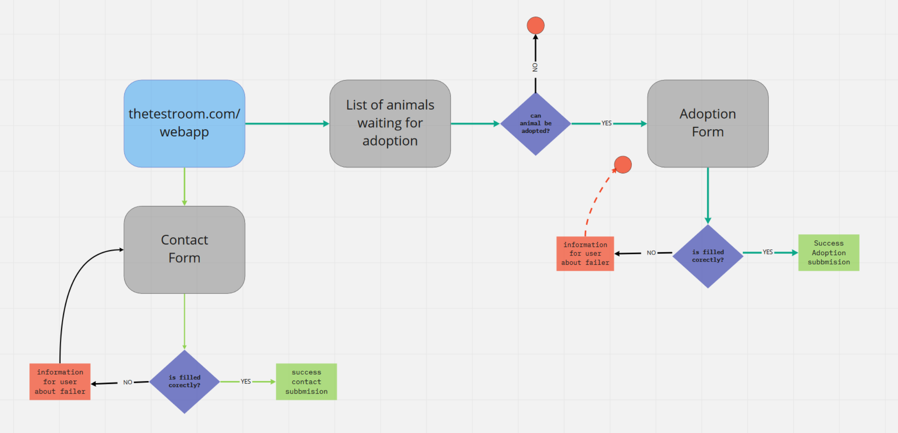
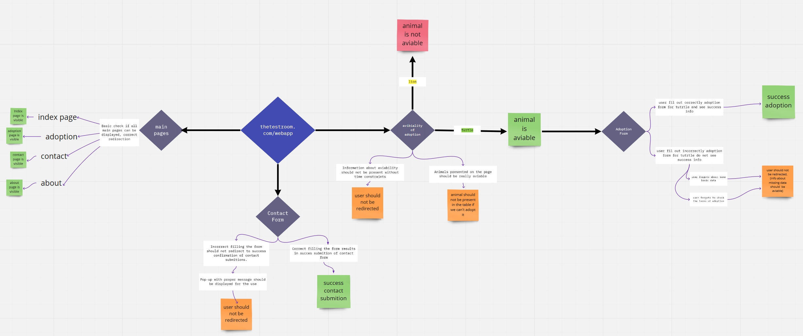

# cypress-training
Repo to practice cypress
--------------------------------------------------
###  Sample test result and execution from cypress dashboard:  
https://dashboard.cypress.io/projects/n9u7wm/runs/2/specs

--------------------------------------------------
###  Diagram with basic test paths:

  

--------------------------------------------------
###  My mind map of testing:

  

